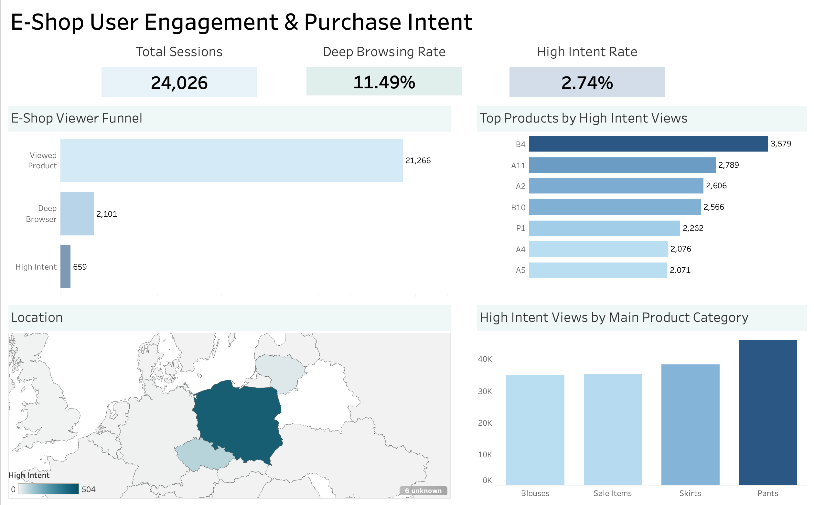

# 🛍️ E-Shop User Engagement & Purchase Intent Analysis
**SQL + Tableau Dashboard Project**

🔗 **Interactive Tableau Dashboard:**  
https://public.tableau.com/app/profile/dmitry.kuvyrdin/viz/E-ShopUserEngagementPurchaseIntent-InteractiveDashboard/Dashboard1?publish=yes

📂 **SQL Queries:**  
./sql

---

## 1. Project Overview

This project analyzes **consumer viewing and buying behavior** for an online clothing e-shop using SQL and Tableau.  
The objective is to understand how users progress from casual browsing to high-purchase intent, identify product and geographic trends, and surface opportunities to improve conversion.

The analysis reflects a **product analytics workflow**, moving from raw event-level data to actionable business insights.

---

## 2. Dataset Description

The dataset is based on real e-commerce behavioral research:

**Citation:**  
Łapczyński M., Białowąs S. (2013).  
*Discovering Patterns of Users' Behaviour in an E-shop – Comparison of Consumer Buying Behaviours in Poland and Other European Countries*,  
**Studia Ekonomiczne**, nr 151, pp. 144–153.

### Dataset Characteristics
* Event-level user interaction data
* Session-based browsing behavior
* Product categories and identifiers
* User geographic location
* Purchase-intent proxy variables (e.g., deep browsing, repeated views)

---

## 3. Queries and Questions

SQL was used to transform raw event data into analytical tables that support funnel and intent analysis.

### Key Questions
* What percentage of users meaningfully engage beyond surface-level browsing?
* Where do users drop off in the engagement funnel?
* Which products and categories generate the strongest purchase intent?
* Which countries show high intent relative to total traffic?

### SQL Techniques Used
* Common Table Expressions (CTEs)
* Window functions
* Conditional aggregation
* Multi-table joins

📂 **View all SQL queries:**  
./sql

---

## 4. Analysis and Dashboard

The Tableau dashboard provides an interactive overview of user engagement and purchase intent.

### Dashboard Components
* **KPI Summary**
  * Total Sessions
  * Deep Browsing Rate
  * High Intent Rate
* **Viewer Funnel**
  * Page View → Product View → Deep Browsing → High Intent
* **Top Products**
  * Ranked by high-intent views
* **Geographic Distribution**
  * World map showing engagement by country
* **Category Analysis**
  * High-intent views by main product category

🔗 **Interactive Dashboard:**  
https://public.tableau.com/app/profile/dmitry.kuvyrdin/viz/E-ShopUserEngagementPurchaseIntent-InteractiveDashboard/Dashboard1?publish=yes

---

## 5. Key Findings

* Poland generates the largest share of traffic, as expected given the store’s location.
* Lithuania and the Czech Republic show **strong high-intent engagement relative to their traffic volume**.
* Pants are the most viewed product category overall.
* Funnel analysis shows significant drop-off:
  * ~10% of viewers qualify as deep browsers
  * ~3% reach high purchase intent
* The single most popular item by high-intent views is **Product B4 (Skirt)**.

---

## 6. Recommendations & Next Steps

### Business Recommendations
* Expand targeted marketing in Lithuania and the Czech Republic.
* Investigate why skirts (specifically Product B4) convert better than higher-viewed items.
* Improve mid-funnel experiences to reduce drop-off from deep browsing to high intent.

### Analytical Next Steps
* Incorporate confirmed purchase data to validate intent metrics.
* Perform cohort analysis on returning users.
* Add time-based trend analysis.
* Segment users by new vs. returning status.

---

## 7. Tools Used

* SQL
* DBeaver
* pgAdmin 4
* Tableau Public

---

### Author
**Dmitry Kuvyrdin**  
🔗 Tableau Public Profile: https://public.tableau.com/app/profile/dmitry.kuvyrdin
